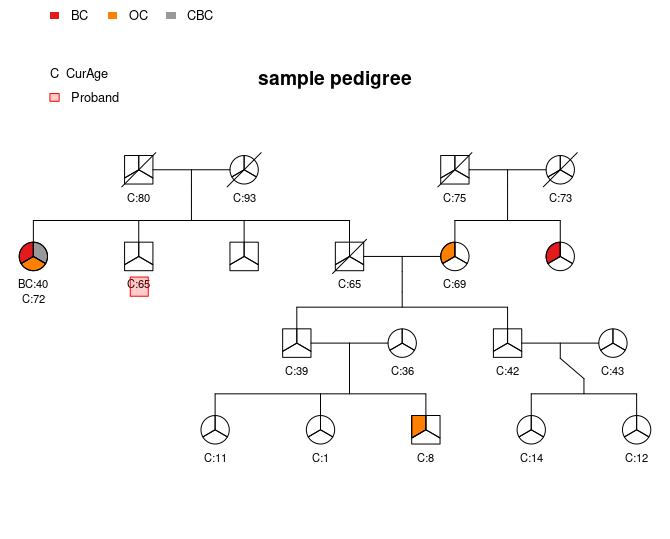

```{r setup, include=FALSE}
knitr::opts_chunk$set(echo = TRUE)
```

## Statistics warm-up

Consider a random variable $X$ with a probability density function

$$
f(x) = \frac{c}{\sqrt{x(b-x)}}, \quad 0<x<b,
$$ where $c$ is a normalising constant and $b$ is a parameter.

-   Find $c$ such that the probability density function is valid.

**Solution**:

Because of the non-negativity of a pdf given all possible x, and we have

$$ \sqrt{x(b-x)} > 0 $$
Thus, we need c \> 0.

Then for f(x), we want 
$$  \int^b_0f(x)dx= 1$$,
$$  \int^b _0 \frac{c}{\sqrt{x(b-x)}}dx = 1 $$
$$ \ 2c\arcsin(\frac{\sqrt{x}}{\sqrt{b}})  |^b_0  = 1$$ for b\>0
$$ 2c (\arcsin(1) - \ arcsin(0)) = 1$$ $$ 2c * \frac{\pi}{2} = 1$$
$$ c = \frac{1}{\pi}$$

-   Find the corresponding cumulative distribution function, $F(x)$ and
    its inverse $F^{-1}(x)$.
    
**Solution**:
$$ F(x) = \begin{cases} 0, \ x \le 0 \\ \frac{2}{\pi} \arcsin(\frac{\sqrt{x}}{\sqrt{b}}),  \ 0 <x <b \\ 1, \ x \ge b \end{cases}
$$

for 0 \< x \< b, calculating its $F^{-1}(x)$ by interchanging x and F(x)
-- y and solve for y.

The result is: $$ F^{-1}(x) = bsin^2(\frac{x \pi}{2})$$

-   Describe a procedure to generate samples distributed according to
    $X$, given a set of uniformly distributed samples
    $u_1,\dots,u_n \sim \mathcal{U}[0,1]$.
    
**Solution**:
1.  Given the PDF of X, compute its CDF and inverse CDF
2.  Use a random number generator in R and set a seed for
    reproducibility.\
3.  Generate random numbers that are uniformly distributed
    ($u_1,\dots,u_n \sim \mathcal{U}[0,1]$).
4.  Apply the inverse CDF function to the generated samples from the
    previous step to fit the distribution of X.

-   Set the seed to 42 and generate 1,000 samples distributed according
    to $X$ using 1,000 uniformly distributed i.i.d. $\mathcal{U}[0,1]$
    samples, with $b=5$. Plot a histogram of the resulting samples.

```{r}
# Setting seed to 42
set.seed(42)

# Generating the uniformly distributed 1000 samples 
sample_uni <- runif(1000)

# Plug in b=5 and apply the inverse CDF function
sample_X <- 5*(sin(sample_uni*pi/2))^2

# Plotting the samples into a histogram
hist(sample_X, main = "Sample Distribution (b = 5)", xlab = "Sample Values")
```

-   Assume that we have a set of samples $X_1,\dots,X_n$ which are
    i.i.d. as $X$ with $b$ unknown. Find the log-likelihood function for
    the parameter $b$, $\ell(b;x_1,\dots,x_n)$ and find its derivative
    with respect to $b$, $\frac{d\ell}{db}$.
    
**Solution**:

The PDF is $f(x) = \frac{c}{\sqrt{x(b-x)}} = \frac{1}{\pi\sqrt{x(b-x)}}$
Here we can use maximum likelihood estimation to calculate the log-likelihood function. 
Since the samples are i.i.d, the log-likelihood function can be represented as:
$$\ell(b;x_1,\dots,x_n) = log(\prod^n_{i=1}f(x_i|b)) \\ =log(\prod^n_{i=1}\frac{1}{\pi\sqrt{x_i(b-x_i)}}) \\ = \sum^n_{i=1} log (\frac{1}{\pi\sqrt{x_i(b-x_i)}})$$

Compute its derivative respect to $b$:

$$\frac{d\ell}{db} = \sum^n_{i=1}\frac{2x-b}{2\pi\sqrt{x^3(b-x)^3}} $$

-   Based on the likelihood, or otherwise, give a statistic based on
    $X_1,\dots,X_n$ which is a reasonable estimator for the unknown
    parameter $b$. Explain your choice.
    
**Solution**:
we can set $\frac{d\ell}{db}$ to 0:
$$ \sum^n_{i=1}\frac{2x_i-b}{2\pi\sqrt{x_i^3(b-x_i)^3}} = 0 $$
However, there may not be a closed-form solution to this equation. Thus using a iterate numerical approximation for this equation could be a solution. 

-   The file `samples.rds` contains samples $X_1,\dots,X_n$ distributed
    according to $X$. Report the estimated value of $\hat{b}$ based on
    those samples.
    
**Solution**:

A python script is also included in the files submitted, which sucsessfully coded the answer to this question. 


```{r, eval=FALSE}
# code in R equivalent to the code in the python notebook should be like this: 
samples <- readRDS('./data/samples.rds') # read data 

library(caracas) 
#library(sympy)
b <- symbol("b") # symbolize variable b
l <- function(b){ # put the negative log likelihood function into code 
  sumterm <- 0
  for(i in samples){
    sumterm <- sumterm - log(1/(pi*(-i^0.5*(i-b)^0.5)))
} # We want to minimize the negative log likelihood function, which is maximizing the likelihood (since log function is monotonically increasing)
  return(-sumterm)
}

b_hat <- optim(par = 1, fn = l, method = "BFGS") # Use optim function to find the best estimator b_hat, here I chose a general optimization method in the package which needs less function evaluations.  
```

The estimated value of b_hat is *1225.0* based on the samples given.

## Arrays

You are given a multi-dimensional array `array.rds`. It contains
penetrance curves for various cancers and genes. In simple terms,
penetrances are how likely one will develop a cancer given that they
have a certain corresponding gene mutation. Other variables in `data`
describe different sub-populations. For example, the probabilities
corresponding to `Brain` cancer and gene `APC` are the probabilities for
which a person will develop brain cancer, given that they have a
mutation in the `APC` gene.

-   Read in the data and give the dimensions of the array.

*Hint: Use the `str` function.*

**Solution**:
```{r}
# Read the data into variable called dat_array
dat_array <- readRDS("./data/array.rds")

# show dimensions 
str(dat_array)
```

-   Subset the array for the penetrances associated with `Breast` cancer
    and the `BRCA2` gene for a female with the default race `All_Races`.
    Then plot the penetrance curve (probability versus age).
  
**Solution**:

```{r}
# check attributes to find the array matching the description 
attributes(dat_array)
# check indices for the gene and cancer dimensions for subsetting data
indcancer <- which(unlist(dimnames(dat_array)[1]) == "Breast")
indgene <- which(unlist(dimnames(dat_array)[2]) == "BRCA2")

# we can thus find the indices in each dimension and subset the array 
pen_breast <- dat_array[indcancer,indgene,1,1,]

# convert the array to a dataframe for visualization 
df_pen_breast <- data.frame(Age = names(pen_breast), Probability = pen_breast)

# Plotting the penetrance curve 
library(ggplot2)
ggplot(df_pen_breast, aes(x = as.integer(Age), y = Probability, group = 1))+ 
         geom_path(color = "seagreen")+
         labs(x = "Age")+
         labs(title = 'Penetrance for Breast Cancer and BRCA2 Gene in Female with Defualt Race ')
```

-   Subset the array for the penetrances associated with `Colorectal`
    cancer and the `PALB2` gene for an Asian male. What is the
    probability that a person from this subpopulation at age 50 will
    develop colorectal cancer in the next 10 years given that he has
    tested positive for a PALB2 mutation but is otherwise disease free?
  
**Solution**:

For calculating the probability: need to sum up the cases that if the person gets cancer at age 50, at age 51 -- P(not having cancer at 50)\*P(get cancer at 51), ... , to age 60 -- P(not getting cancer in all previous years )\*(get cencer at 60). 

```{r}
# check index of the gene 
indcancer <- which(unlist(dimnames(dat_array)[1]) == "Colorectal")
indgene <- which(unlist(dimnames(dat_array)[2]) == "PALB2")
# subset data 
pen_colorectal <- dat_array[indcancer,indgene,3,2,]

# calculate the probability of developing the cancer in the next 10 years.  
p <- pen_colorectal[50:60]
ptenyears <- sum(p[1] + (1-p[1])*p[2] + (1-p[1])*(1-p[2])*p[3] + (1-p[1])*(1-p[2])*(1-p[3])*p[4] + (1-p[1])*(1-p[2])*(1-p[3])*(1-p[4])*p[5] + (1-p[1])*(1-p[2])*(1-p[3])*(1-p[4])*(1-p[5])*p[6] + (1-p[1])*(1-p[2])*(1-p[3])*(1-p[4])*(1-p[5])*(1-p[6])*p[7] + (1-p[1])*(1-p[2])*(1-p[3])*(1-p[4])*(1-p[5])*(1-p[6])*(1-p[7])*p[8]+
(1-p[1])*(1-p[2])*(1-p[3])*(1-p[4])*(1-p[5])*(1-p[6])*(1-p[7])*(1-p[8])*p[9]+
(1-p[1])*(1-p[2])*(1-p[3])*(1-p[4])*(1-p[5])*(1-p[6])*(1-p[7])*(1-p[8])*(1-p[9])*p[10]+
(1-p[1])*(1-p[2])*(1-p[3])*(1-p[4])*(1-p[5])*(1-p[6])*(1-p[7])*(1-p[8])*(1-p[9])*(1-p[10])*p[11] )  # adding up the probabilities 

print(ptenyears)
```

## Family pedigrees

Read in the `.rdata` file `pedigree.rda`. Each `data.frame` represents a
family. Each individual is uniquely identified by the first column
called `ID`. Their sex is coded as `0` for females and `1` for males.
Individuals' mother and father are indicated in the `MotherID` and
`FatherID` columns. A value of `NA` in these columns means that this
person is a so-called 'founder' or that a certain parent is missing.

Each pedigree can be thought of as a family tree. For example, a
visualisation of a sample pedigree is shown below. The colours indicate
affliction status for cancers as labelled in the legend.



In the following exercises, you are encouraged to modularise and comment
on your code.

-   Write an R function(s) to count the number of unique nuclear
    families there are in a certain pedigree. A nuclear family is
    defined as the set of two parents and all of their children.

**Solution**:

```{r}
# load the pedigree data
pedigree <- load("./data/pedigree.rda")

# function definition
countnuclear <- function(ped){ 
    # Input: ped -- the pedigree to be calculated for the number of nuclear families
    parents <- data.frame(cbind(ped$MotherID, ped$FatherID)) # subsetting the IDs from both parents 
    cleaned_parents <- parents[complete.cases(parents),] # drop rows including any NA values (only consider as a nuclear family if there are two parents with IDs)
    cleaned_parents <- cleaned_parents[!duplicated(cleaned_parents),] # drop duplicates from the dataframe, only including unique pairs of parents
    return(length(cleaned_parents[,1])) # return the number of rows in the dataframe, which is the number of unique nuclear families in the pedigree
}

```

-   Report the number of nuclear families for the pedigrees contained in
    the `.rda` file.

**Solution**:

```{r}
paste("The number of nuclear families for pedigrees fam10 is", countnuclear(fam10)) 
paste("The number of nuclear families for pedigrees fam50 is", countnuclear(fam50)) 
paste("The number of nuclear families for pedigrees fam75 is", countnuclear(fam75)) 
paste("The number of nuclear families for pedigrees fam100 is", countnuclear(fam100)) 
```
